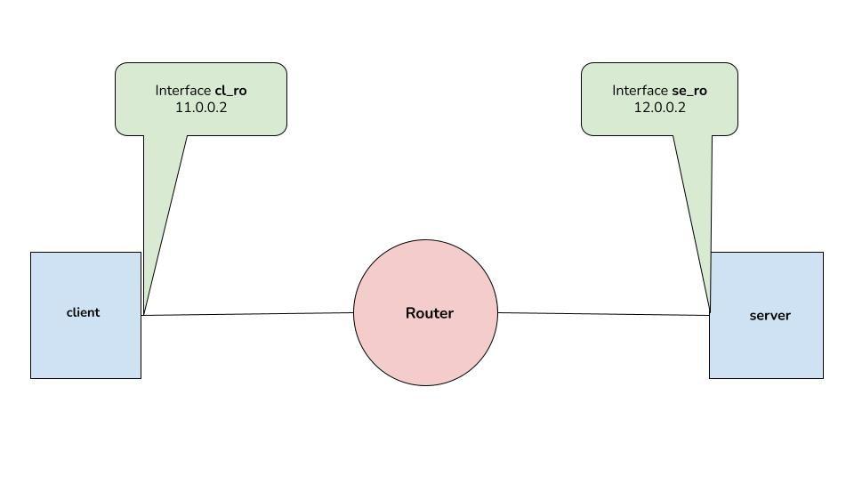

# Network analysis on a simple topology with Wireshark




## Requirements

- Ubuntu Operating System (Or any Linux based OS)
- Wireshark 

    Install wireshark with command: `sudo apt update && sudo apt install wireshark -y`

## Usage

Run the following command in a terminal

```bash
sudo ./setup_topology.sh
```

- This will setup the topology and start 2 wireshark instances in client and server respectively


To destroy the created nodes, run:

```bash
sudo ./destroy_nodes.sh
```


